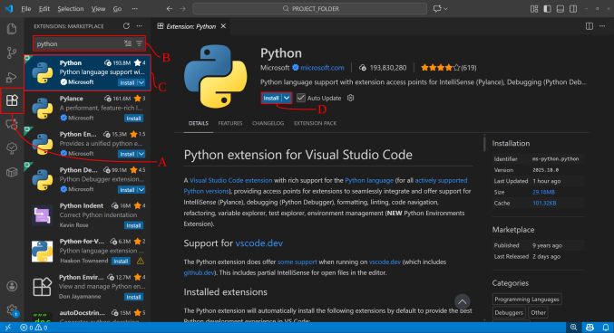
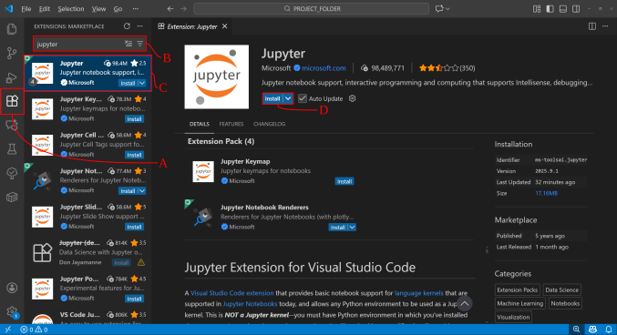
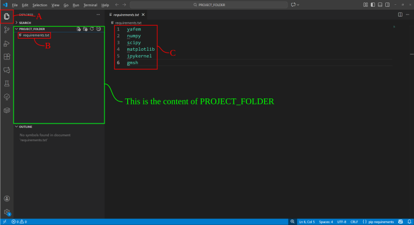
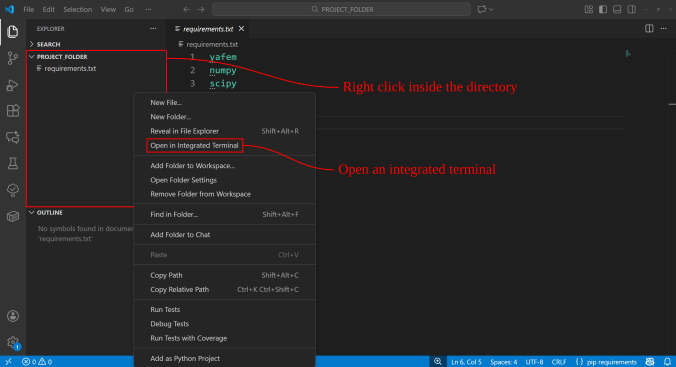
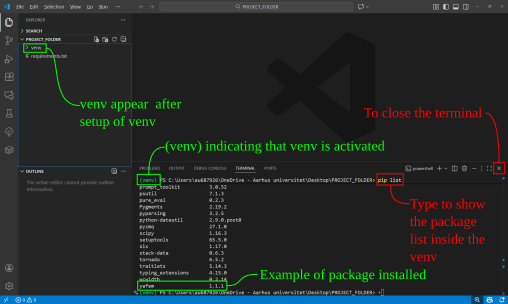

# Install an editor
This tutorial assumes [Visual Studio Code](https://code.visualstudio.com/) (VS Code) as the editor to work with Python. The tutorial applies to Windows operation systems. Installation in Mac/Linux based systems may be different. The basic steps are covered here, but to learn more about virtual enviornments look [here](https://code.visualstudio.com/docs/python/environments).

# Install python and Jupyter

1. Download and install Python from [Python.org](https://www.python.org/downloads/)
2. Install the Python extention in VS-Code by following the <span class="red">**A**</span> - <span class="red">**D**</span> steps below;
    
    

1. Install the Jupyter extention in VS-Code by following the <span class="red">**A**</span>  - <span class="red">**D**</span> steps below;
    
    

# Virtual Environment
1. Open a folder in VS-Code as your project directory, in this example the folder is named  `PROJECT_FOLDER`, Found through <span class="red">**A**</span>.
2. Inside the `PROJECT_FOLDER` save `requirements.txt` file inside the folder as shown in <span class="red">**B**</span>.
3. The `requirements.txt` contains a list of all the packages installed in the virtual environment (venv), as shown in <span class="red">**C**</span>.

    

4. Open an integrated terminal as shown below;

    
5. A powershell terminal appears, where the following commands are executed:
    1. ```powershell
        Set-ExecutionPolicy Unrestricted -Scope Current # Unrestrict execution policy in Windows (needed only once for initial venv setup).
    2. ```powershell
        python -m venv venv # Setup the virtual envionment.
    3. ```powershell
        .\venv\scripts\activate # Activate the virtual envionment. the text "(venv)" should appear at the beginning of the command line.
    4. ```powershell
        python.exe -m pip install --upgrade pip # Update the pip (not necessarily needed).
    5. ```powershell
        pip install -r requirements.txt # install the packages
6. The packages should now be installed. To check the package content of the venv, type the following command;
    ```powershell
        pip list # See the list of packages installed inside the venv
    ```
