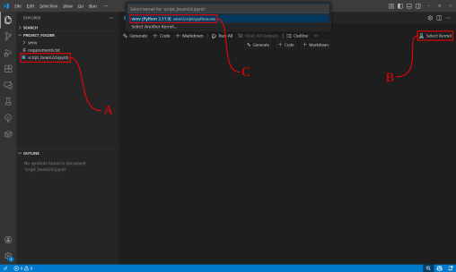
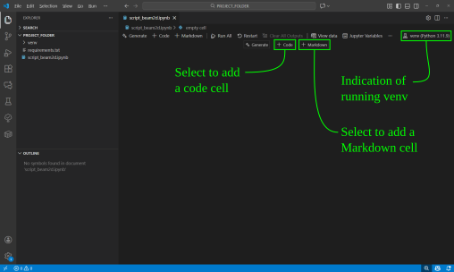
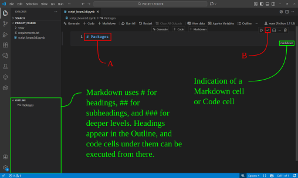
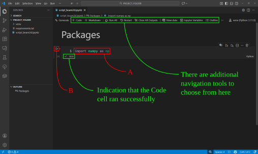

# Setup of interactive notebook
This presentation demonstraties how to setup an interactive python notebook `.ipynb` as our interactive computing environment. Follow the steps below supported by an image;

1. Create a new file and name it `script_beam2d.ipynb` (shown as **A**).
2. Select "Select Kernel" to choose the virtual enviornment (venv) to run (shown as **B**)
3. Select the venv which is installed in the directory (Shown as **C**).
    1. You may initially need to select `Install/Enable suggested exttensions` in the selection window **C** shown in the figure.
    2. You may initially need to select `Python Enviornments...` in the selection window **C** shown in the figure.

The notebook is now fully setup with the created venv selected as our Kernel. We now have the option to add code cells, and Markdown cells.

## Navigation in the the notebook

We can now add a Markdown cell and type `# Packages` according to **A**. To render the Markdown cell press **B**. Notice that the added Markdown cell is a heading, which in turn shows up in the Outline.

Next we can add a Code cell containing Python code. Type the following according to **A** and execute the cell in **B**. \
Located at the very top of the window, we have additional navigation and execution tools. From here, we can add a `Code` cell, a `Markdown` cell and run all the cells by pressing `Run All`. To clear the variable space and restart the venv, press `Restart`. Inside `Jupyter Variable` is our variable space, where we can inspect all our stored variables.

## Hotkeys

Working in a Jupyter Notebook using the default hotkeys makes coding substantially faster and more enjoyable and is therefor highly recommended to get familiar with. This tutorial won't however cover the this topic, but can be found [here](https://code.visualstudio.com/docs/datascience/jupyter-notebooks).