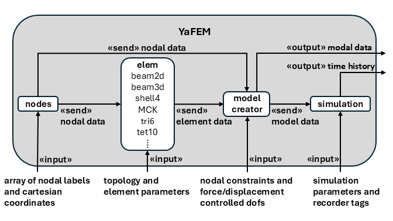
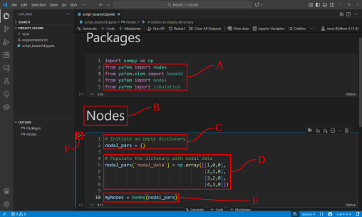
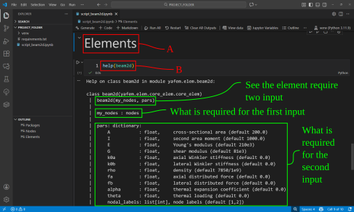
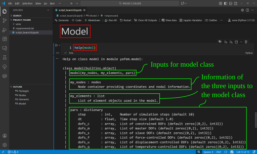
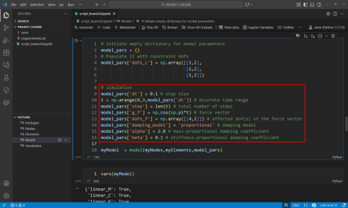

# Creating a model
This tutorial demonstrates how to create a model in YaFEM. The demonstration consideres a cantilever beam in 2D.

There are overall 4 steps to take using YaFEM:
1. Define the $xyz$ nodal nodal coordinats in the `nodes` class.
2. Define the elements, in this case 2D beam elements, from the `elem` class.
3. Create the model, based on the nodes and elements in the `model` class.
4. Simulate time-history analysis of the model in the `simulation` class.



---

# Nodes
Follow the steps below, supported by the image, to build a nodal basis
1. Import all the necessary yafem subpackages as shown in <span style="color: red; font-weight: bold;">A</span>. Namly `nodes`, `beam2d`, `model` and `simulation`. Run the cell again after they have been added.

    ``` python
    import numpy as np
    from yafem import nodes
    from yafem.elem import beam2d
    from yafem import model
    from yafem import simulation
    ```

2. Let us make a new header named `# Nodes` ans shown in <span style="color: red; font-weight: bold;">B</span>.

3. Create a Code cell under `# Nodes` and add the <a href="https://docs.python.org/3/tutorial/datastructures.html#dictionaries"
   style="font-weight: bold;">dictionary</a>
as shown in <span style="color: red; font-weight: bold;">C</span>.

    ``` python
    # Initiate an empty dictionary
    nodal_pars = {}
    ```
4. Populate the dictionary with a 
<a href="https://numpy.org/"
   style="font-weight: bold;">numpy</a> and add the four nodes labeled 1-4 as shown in <span style="color: red; font-weight: bold;">D</span>.

    ``` python
    # Populate the dictonary with nodal data
    nodal_pars['nodal_data'] = np.array([[1,0,0],
                                         [2,1,0],
                                         [3,2,0],
                                         [4,3,0]]
    ```

5. Parse the populated dictionary `nodal_pars` to the `nodes` class, and store it to variable `myNodes` as shown in <span style="color: red; font-weight: bold;">E</span>.

    ``` python
    myNodes = nodes(nodal_pars)
    ```


6. Run the cell as shown in <span style="color: red; font-weight: bold;">F</span>.




---

If in doubt of what a required input is to a `yafem` class, simply type `help(class)` as  shown in <span style="color: red; font-weight: bold;">A</span> in the figure below. From the help function, we can also see which `Methods` are available inside the class. For instance the `plot` function is suggested for `nodes` along with the input to the method. 

``` python
help(nodes)
```


---

To see all the content of `myNodes` use `vars` as shown below in <span style="color: red; font-weight: bold;">A</span>. To call a specific value/array, for instance the nodal coordinates, type `myNodes.nodal_coords` as shown in <span style="color: red; font-weight: bold;">B</span>. 

``` python
vars(myNodes)
```

``` python
myNodes.nodal_coords 
```


---

To plot the nodes, type `myNodes.plot()`. To see the inputs for the plot function to manipulate the plot, for instance `figsize`, see the `help(nodes)` which was demonstrated earlier. 

``` python
myNodes.plot(figsize=6)
```


---
# Elements

Let us start a new header named Elements as shown in <span style="color: red; font-weight: bold;">A</span> and create a Code cell under it. Type `help(beam2d)`, as shown in <span style="color: red; font-weight: bold;">B</span> to inspect the class and see the input variables for the `beam2d` element. 

``` python
help(beam2d)
```



---

Following the information provided by `help(beam2d)`, the elements are setup accordingly and stored into a list as shown in the figure below. 

``` python
# Initiate an empty dictionary containing the common element parameters
elem_pars = {}
elem_pars['A'] = 0.1 * 0.1
elem_pars['I'] = 0.1 * 0.1**3 / 12

# element 1
elem1_pars = elem_pars.copy()
elem1_pars['nodal_labels'] = np.array([1,2])

# element 2
elem2_pars = elem_pars.copy()
elem2_pars['nodal_labels'] = np.array([2,3])

# element 3
elem3_pars = elem_pars.copy()
elem3_pars['nodal_labels'] = np.array([3,4])

myElements = [beam2d(myNodes,elem1_pars),
              beam2d(myNodes,elem2_pars),
              beam2d(myNodes,elem3_pars)]
```


----
# Model

With the list of elements complete, we can build our model. Similar with the `nodes` and `beam2d` classes, we can use `help(model)` to see the input for the class as shown in the image below. \

``` python
help(model)
```



---

The model parameters are provided as a dictionary, for this example we provide the constrained dofs `dofs_c`. We constrain all the dofs for the first node. Finally we parse all the inputs to the `model` class and save it to `myModel` as shown in <span style="color: red; font-weight: bold;">A</span>. To see all the stored variables inside `myModel`. To check the information stored in `model`, we can use `vars(myModel)` as shown in <span style="color: red; font-weight: bold;">B</span>. 

``` python
# Initiate empty dictionary for model parameters
model_pars = {}
# Populate it with constraint dofs
model_pars['dofs_c'] = np.array([[1,1],
                                 [1,2],
                                 [1,3]])

myModel  = model(myNodes,myElements,model_pars)
```

``` python
vars(myModel)
```


---

Calling matrices, e.g. the stiffness matrix from the model class, like done below, yields a sparse form of the stiffness matrix;

```python
myModel.K
```
To represent the matrix as a dense form do the following;
```python
myModel.K.todense()
```
---
## Modal analysis

Through the `model` class, we can compute the modal analysis. As demonstrated in <span style="color: red; font-weight: bold;">A</span> the modal analysis is computed for the first three modes. We can then save it to `omega` and `phi`. We can also plot the complete model. The plot method in the `model` class supports plotting responses, where the first modal mode in `phi` is parsed as demonstrated in <span style="color: red; font-weight: bold;">B</span>. 

``` python
omega, phi = myModel.compute_modal(3)

myModel.plot(response=phi[:,0],scale=1e-4,rotate=(-90,0),figsize=6)
```


---

# Simulation

The `simulation` class provide simulation algorithms such as static and dynamic simulation to simulate the model, generated from the `model` class. 

The first thing to do, is to add additional parameters to the model, which is needed to perform the simulation. We therefore return to the cell where we generated our model and add the parameters shown below.

``` python
# simulation 
model_pars['dt'] = 0.1 # step size
t = np.arange(0,3,model_pars['dt']) # discrete time range
model_pars['step'] = len(t) # total number of steps
model_pars['g_f'] = np.cos(np.pi*t) # force vector
model_pars['dofs_f'] = np.array([[4,2]]) # affected dof(s) of the force vector
model_pars['damping_model'] = 'proportional' # damping model
model_pars['alpha'] = 2.0 # mass-proportional damping coefficient
model_pars['beta'] = 0.1 # stiffness-proportional damping coefficient
```



---

Once added, we can then go to the end of our notebook and add the `# Simulation` header along with the code that goes with it. Demonstrated below is a dynamic simulation. The `output=False` ensures that information of the convergance for each step is not printed. The response is then plotted as a demonstration at the end by using <a href="https://matplotlib.org/"
   style="font-weight: bold;">Matplotlib</a>.


``` python
mySimulation = simulation(myModel)
```

``` python
[u,v,a,r] = mySimulation.dynamic_analysis(output=False)
```

``` python
import matplotlib.pyplot as plt
plt.figure(figsize=(4, 2))
plt.plot(t,u[8,:])
```

